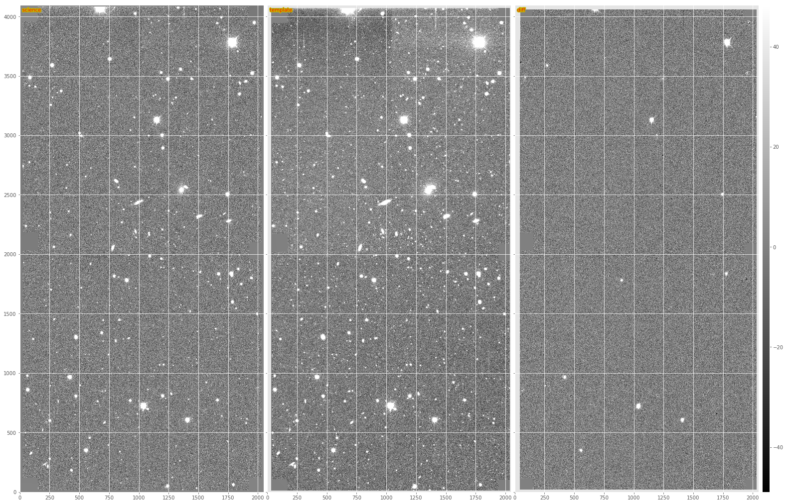
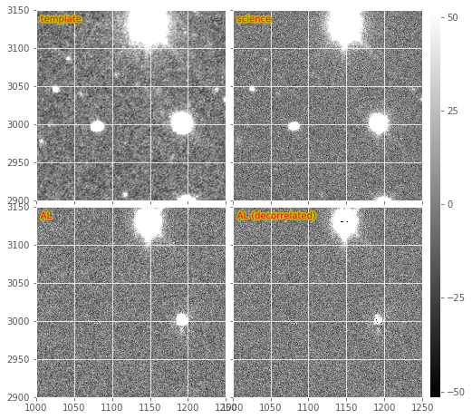
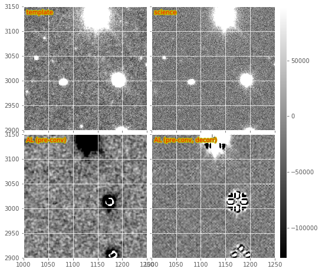

# Current state of image subtraction in the LSST stack

# 1. Alard and Lupton (AL) PSF matching and image subtraction

The AL algorithm is used by default in `ip_diffim` to perform PSF matching and image subtraction. It performs quickly and well because it uses small regions surrounding bright, isolated stars around to compute the PSF-matching kernel, $k_i$, at various locations $i$ across the image. It uses various heuristics to pre-filter those bright stars prior to computation of the $k_i$, and once they are computed, uses PCA to estimate a smoothly spatially-varying $k$ from them.

There are a very large number of configuration parameters which affect the quality of the subtraction. In general, the defaults work well, although for images with different pixel-scales and/or PSF sizes, these parameters may need to be tuned. Many of these important parameters are buried deep in the `kernel` config parameter of the `subtract` algorithm (a reference to the `lsst.ip.diffim.ImagePsfMatchTask` task).

The image subtraction script is in `lsst.pipe.tasks.imageDifference`, which performs image subtraction and then detects and measures sources (`diaSources`) in the subtractions. This task itself very recently was refactored (DM-3704) and split into two separate tasks which now reside in `ip_diffim`: `MakeDiffimTask` and `ProcessDiffimTask`, which are called sequentially from the command-line `imageDifference.py`.

In [Figure 1](#figure-1) and [Figure 2](#figure-2), we show an image subtraction using the AL algorithm on an example DECam image. Here we use a single `calexp` as the template to highlight the effects of noise in the template and how these are mitigated. Note that the subtraction is decorrelated (see Section 1.2.), as this is now the default when image subtraction is run via the LSST stack.

## 1.1. Pre-convolution

An un-published modification to the AL algorithm was implemented, which accounts for the occasions when the width of the PSF of the science image is $\leq$ the width of the PSF of the template image. In this case, AL cannot convolve the template to match that of the science image; it instead would need to deconvolve the template, which would result in ringing artifacts. Instead, the science image is "pre-convolved," or "pre-filtered" with its own PSF, or a Gaussian approximation of it. If the template PSF is narrower than $\sqrt{2}\times$ that of the science image, then AL will now work, but the resulting image subtraction will have been pre-filtered by the science image's PSF. This image then corresponds to the match-filtered "likelihood" image subtraction, which has already been convolved with its own PSF, and thus for detection, just needs to be thresholded. A special case is then needed to do any kind of measurement on detected sources in this image. I am not entirely sure how that works.

## 1.2. AL Decorrelation

When the template exposure has significant noise (i.e., is not constructed from a number of coadds), then AL will correlate the noise among neighboring pixels when it convolves the template with the PSF-matching kernel, $k$. As a result, the noise will be correlated in the image subtraction, leading to inaccurate detection and measurement (see [DMTN-006](https://dmtn-021.lsst.io/) for details). In [DMTN-021](https://dmtn-021.lsst.io/), we describe a method for "decorrelating" the AL image subtraction, and this has been implemented in the LSST image subtraction code, in the module `lsst.ip.diffim.imageDecorrelation`. Decorrelation is toggled via the `doDecorrelation` config option, which is enabled by default. Below in [Figure 2](#figure-2) we show a subsection of the images from [Figure 1](#figure-1), including both the regular (non-decorrelated) and the default (decorrelated) AL subtractions on the bottom.

See section (1.2.1) below for details and complications of implementing decorrelation in the case of pre-convolution (section 1.1), and see section (3) below for details about how the decorrelation is performed, when accounting for spatially-varying PSFs and noise.

### 1.2.1. Decorrelation + pre-convolution: aliasing issues

The variant of the expression for performing decorrelation in the case of pre-convolution (described above) is given by the deconvolution kernel, $\psi(k)$ as described in [Equation 3 in DMTN-021](https://dmtn-021.lsst.io/#equation-equation-3). The expression includes the pre-filter kernel, $M(k)$ described above.

This modified decorrelation kernel has been implemented in `ip_diffim`, and is used automatically in `imageDifference.py` when both the `doDecorrelation` and the `doPreConvolution` config options are enabled. However, in many cases the decorrelation kernel is unstable due to the inclusion of the PSF in the denominator. This leads strange ringing-type artifacts in the resulting decorrelated likelihood image subtraction. (But see below about Zogy and how these ringing artifacts may be a result of how the PSFs are measured, rather than a result of issues with the algorithm itself.)

In [Figure 3](#figure-3), we show the same DECam image subsection as in [Figure 2](#figure-2), but in which the template and science image were swapped and pre-convolution is turned on. The bottom two sub-images show the resulting match-filtered subtractions, with and without decorrelation enabled.

# 2. Zackay, et al. (2016) (ZOGY) image subtraction

## 2.1. Variants (image-space convolutions)

## 2.3. The ZOGY $S_{corr}$ image

## 2.3. Issues, unimplemented aspects, artifacts

# 3. Spatial variations via `ImageMapReduce`

## 3.1. Implementation details

## 3.2. Known issues

# 4. Conclusions and recommendations for future work

------
1. decorrelation + preconvolution not working
2. zogy artifacts
3. imageMapReduce gridding could be optimized, right now makes the map-reduce part slow.
4. use of coaddPsf not ideal -- detection is fast but measurement is SLOW
5. issue with zogy when psfs have different dimensions (offset due to psf padding)
--- this is now fixed but points out issues when images are not properly flux-calibrated
6. additional artifacts when zogy run with image-space convolutions
7. differences between what is produced by A&L vs. ZOGY (e.g. matched template, etc.) and how to handle that with DipoleFitting. Zogy in spatially varying mode does not return the matchedTemplate, and thus it is not used for dipole fititng.
- the cross-convolved images in Zogy are not useful for dipole fitting.
8. spatially-varying decorrelation is done by computing the kernel on chunks, and then convolving it on those chunks. should consider computing on chunks, then creating smoothly spatially-varying kernel, then convolving the image w/ the spatially varying kernel
